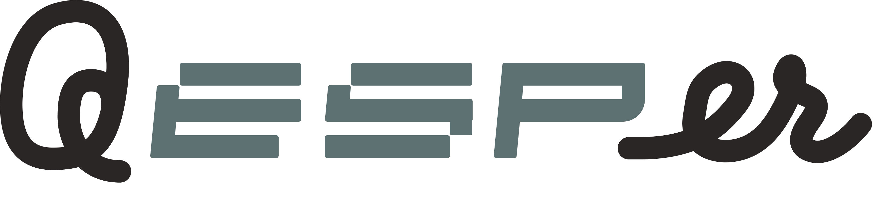
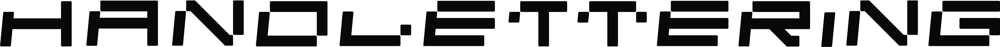

 
<h1 align="center">(Work in progress).</h1>

 

  
  

  <!--  Redundant title? <h3 align="center">Qesper.</h3> -->
  

  It's like the name <strong><i>Casper</i></strong>, but instead it's bits of <strong>sequencer</strong>, and <strong>ESP</strong> mashed together. 
    Whatever dude. It's an ESP8266 based drum sequencer.
     
  

---

  <i>Oh, by the way!</i> &nbsp; &nbsp; <i>by yours truly</i>. 
  <a href="https://github.com/AlbertSmit/QesperDisplay.otf">
    It's Open Source! You can find it here.
  </a>

<!-- TABLE OF CONTENTS -->
## Table of Contents

* [About the Project](#about-the-project)
  * [Built With](#built-with)
* [Getting Started](#getting-started)
  * [Prerequisites](#prerequisites)
* [Usage](#usage)
* [Contact](#contact)

<!-- ABOUT THE PROJECT -->
## About The Project

I wanted a little drum machine to jam with.

I had a ton of spare electrical parts laying around the house.\
To give in idea of what those consist of:
- **Home automation** (somehow wanted a doorbell in HomeKit).
- **Leftover guitar effects** (make some **noise**).
- **Leftover parts of a very early [OTTO](https://github.com/OTTO-project/OTTO)** (hence, lots of buttons).
- **Random electronic crap** (that I would otherwise throw away by now).

I am a (frontend) developer, so I figured; _**why not make one**_.

> _sidenote_: My main language is JavaScript, so cut me some slack in the C++ domain. :wink:

### Built With
* [U8g2](https://github.com/olikraus/u8g2)
* [Mozzi](https://github.com/sensorium/Mozzi)
* [AceButton](https://github.com/bxparks/AceButton)
* [RotaryEncoder](https://github.com/mathertel/RotaryEncoder)
* [Gaussian](https://github.com/ivanseidel/Gaussian)

<!-- GETTING STARTED -->
## Getting Started

Still busy writing this.

### Prerequisites

- ESP8266 (Other boards might work; have not tested).
- An OLED (I use a a cheap 128x64 **SSD1306** OLED).
- Any I2S DAC supported by Mozzi (I got a cheap **Max98357**).
- Some mechanical buttons.
- A rotary encoder.
- Various general electronics like resistors and diodes.

<!-- USAGE EXAMPLES -->
## Usage

Will follow later.

<!-- CONTACT -->
## Contact

Albert - talkto@albertsm.it

Project Link: [https://github.com/albertsmit/qesper](https://github.com/albertsmit/qesper)
