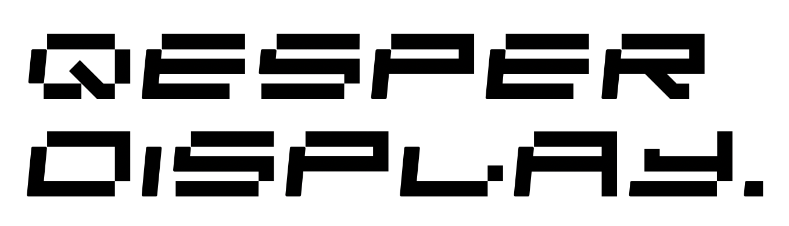
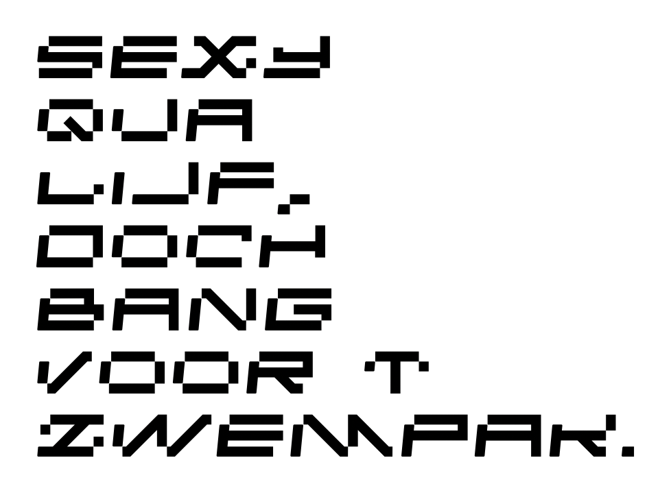

<p align="center">  
  <a href="https://github.com/albertsmit/qesper/tree/develop/fonts/Qesper%20Display">
    
  </a>
</p>
---
This font is a work in progress, alongside this project (**Qesper** as a synth).

## Pangram
<p align="center">  
    
</p>

## What are all these files?
```
    README.md
    LICENSE.md
    QesperDisplay.glyphs
    /dist
    /images
```

- **README.md**
the file you are reading.
- **LICENSE.md**
has the given license for this font.
- **QesperDisplay.glyphs**
is the working file for this font. You can open it with Glyphs / Glyphs Mini.
- **/dist**
is the folder that will house future _consumable_ files; i.e. `.ttf` and `.otf`.

## Suggestions
Feel you got any suggestions or improvements? Feel free to make an issue or PR.

## License?
Fully _Open Source_ (SIL); check out `LICENSE.md`.


---
With love,\
_Albert_
